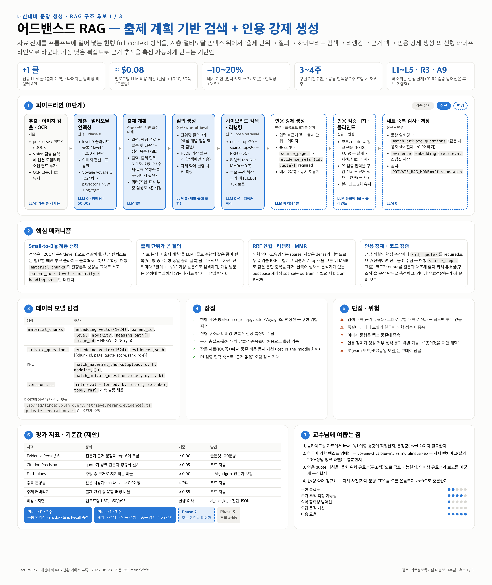
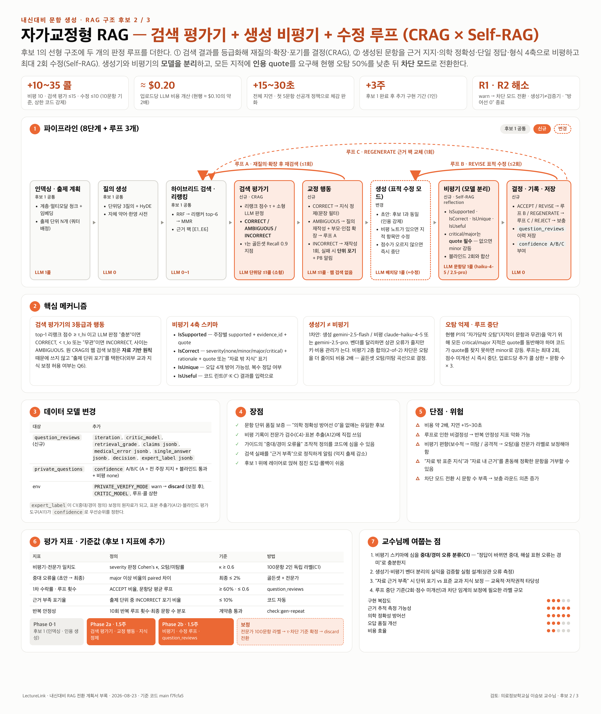
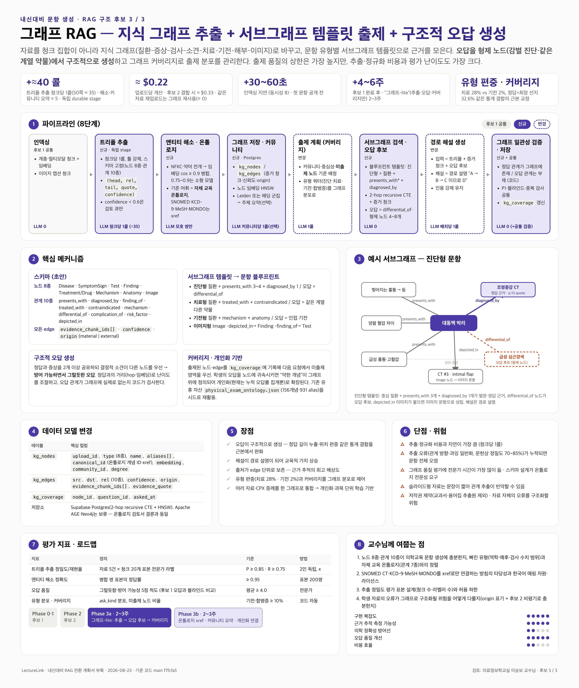

# 내신대비 문항 생성 파이프라인 RAG 전환 — 구조 후보 3안 기술 검토 요청서

- 수신: 의료정보학교실 이승보 교수님
- 발신: LectureLink 개발팀 (전재현)
- 작성일: 2026-08-23
- 기준 코드: `main` `f7fcfa5` (2026-08-23)
- 요청 사항: 아래 3개 후보 구조의 **기술적 타당성·평가 설계·의학 온톨로지 적용**에 대한 피드백
- 첨부: 후보별 1장 인포그래픽 3매 (`infographic-1-advanced-rag.png`, `infographic-2-self-corrective-rag.png`, `infographic-3-graph-rag.png`)

---

## 0. 요약 (1쪽)

**배경.** 내신대비(학생이 올린 강의자료로 국시형 5지선다 문항을 만드는 기능)는 현재 **검색 계층이 없는 full-context 방식**입니다. 자료 텍스트(최대 150,000자)를 배치 수만큼 구간으로 잘라 프롬프트에 통째로 싣고, 출처는 모델의 자가 신고(페이지 번호)에 의존하며, 중복 검사는 배치 내부 2문항의 문자열 비교뿐입니다. 「성능지표 측정 및 검증 가이드」(2026.08)가 요구하는 **근거 충실도·출처 위치 유효성·중복 문항률**을 잴 구조 자체가 없습니다. 이를 RAG(Retrieval-Augmented Generation) 구조로 재구성하려 합니다.

**3개 후보.**

| 후보 | 핵심 아이디어 | 한 줄 평가 |
|---|---|---|
| **1. 어드밴스드 RAG** | 계층적·멀티모달 인덱싱 + 출제 계획 기반 질의 생성 + 하이브리드 검색·리랭킹 + 인용 강제 생성 | 가장 낮은 복잡도로 근거 추적을 측정 가능하게 만드는 **기반안** |
| **2. 자가교정형 RAG** | 후보 1 위에 **검색 평가기**(CRAG)와 **생성 비평기·수정 루프**(Self-RAG)를 얹고, 생성기와 비평기의 모델을 분리 | 의학 정확성 방어선을 실제로 세우는 **품질안** |
| **3. 그래프 RAG** | 자료에서 지식 그래프(질환–증상–검사–치료–기전)를 추출·정규화하고, 문항 유형별 서브그래프로 출제·오답 생성 | 오답 품질·주제 커버리지·개인화의 상한을 올리는 **확장안** |

**추천 방향(가설).** 3안은 배타적이지 않습니다. **공통 인덱싱 계층 → 후보 1 → 후보 2를 검증 레이어로 추가 → 후보 3을 오답·커버리지 모듈로 축소 도입**의 단계적 경로를 가설로 두고 있으며, 이 순서가 맞는지 자체가 교수님께 여쭙는 첫 질문입니다.

**교수님께 여쭙는 핵심 질문 (상세는 8장).**

1. 의학 강의자료(슬라이드·강의록·스캔본 혼재)에 맞는 **청킹 단위**와 계층 구조
2. 한국어·영어 혼용 의학 텍스트에 쓸 **임베딩·리랭커 모델 선택과 검증 방법**
3. "문장 단위 인용(quote) 매칭"을 **출처 위치 유효성**의 조작적 정의로 인정할 수 있는지, LLM 판정기 보정에 필요한 전문가 라벨 규모
4. 자가교정 루프에 심을 **중대/경미 오류 분류(C1)**와 루프 중단 기준
5. 그래프 스키마(노드 8종·관계 10종)의 적절성과 자체 교육 온톨로지 기준 **SNOMED CT / KCD-9 / MeSH xref 연계** 시 한국어 매핑 자원·라이선스
6. 3안을 공정 비교할 **골든셋·블라인드 평가 설계와 표본 크기**

---

## 1. 현행 파이프라인과 한계

### 1.1 현행 흐름 (코드 기준 사실)

```
업로드(POST /api/uploads) → [선택] 사전분석 1콜 → process(QStash 큐, maxDuration 300s)
 → 다운로드·sha256 → 세션 간 중복 방지(이전 발문 30개) → 참고자료 형식 프로파일 1콜
 → 추출(pdf-parse/PPTX/DOCX, ≤150,000자, ≤100p) → 의료 이미지 검출(Vision, 슬라이드당 1콜, ≤40)
 → 이미지 선별 1콜 → OCR(크롭당 1콜) → 청킹·material_chunks 저장(1,200자, 결정론)
 → 컨텍스트 조립("## 슬라이드 N" 블록) → 초점 추출(규칙 기반, ≤24) → 배치 계획(2문항/배치, 동시 8)
 → 구간 분할(≥20,000자일 때, 10% overlap) → 이미지 정제(마스킹·표식)
 → 생성(배치당 1콜, gemini-2.5-flash, tool 강제) → 형식 정규화(5지·F17-L·셔플)
 → 이미지 쿼터 교정(≤1콜/배치) → 검증 1패스(문항당 1콜, warn) → 블라인드 풀이(이미지 문항당 2콜, discard)
 → 깨진 그림 참조 차단 → 해설 규격 기록 → source_refs(페이지 자가 신고) → 품질 게이트(경고만)
 → private_questions upsert → 이미지 저장 → 보충 라운드(≤3) → 알림(P8) → 완료·진단
```

- 모든 LLM 호출은 `lib/ai/client.ts`의 `createMessage()`를 거치며, 기본 provider가 Gemini이므로 생성·검증·Vision·OCR·블라인드 전부 **`gemini-2.5-flash`** 입니다.
- 요청당 LLM 콜 개산(10문항): 프로파일 1 + Vision ≤40 + 선별 1 + OCR(크롭 수) + 생성 5 + 쿼터 교정 ≤5 + 검증 10 + 블라인드 2×이미지문항 + 재작성 ≤5 + 보충.
- 주요 상수: `GEN_BATCH_MAX_QUESTIONS=2`, `GEN_CONCURRENCY=8`, `MAX_CHUNK_CHARS=1200`, `PRIVATE_VERIFY_REJECT_SCORE=0.6`, `BLIND_ATTEMPTS=2`, `DUPLICATE_SIMILARITY_THRESHOLD=0.92`, `MAX_DAILY_AI_COST_USD=100`.

### 1.2 RAG 전환이 필요한 이유 — 코드가 자인하는 한계 6가지

| # | 한계 | 근거 위치 | 가이드 지표와의 관계 |
|---|---|---|---|
| L1 | **검색이 없다.** 전체 텍스트를 배치별 구간으로 나눠 통째로 투입. 배치 5개면 컨텍스트가 5번 과금 | `private-generation.ts:2484~2490` | 비용·지연, 장문 자료에서 "중간 소실(lost-in-the-middle)" |
| L2 | **청크는 저장되지만 조회에 쓰이지 않는다.** `material_chunks`는 사후 인용(페이지→청크 역인덱스)용 | `docs/source-tracking.md §7` | A9(검색 계층) 미착수 |
| L3 | **출처는 모델 자가 신고(페이지 번호)**, 코드는 존재 여부만 검사. 문장·문단 단위 근거 없음 | `lib/ai/source-refs.ts:1~15` | 근거 충실도·출처 위치 유효성 측정 불가 |
| L4 | **중복 탐지가 배치 내 2문항 lexical 비교뿐.** `private_questions`에 임베딩 컬럼 없음, Voyage 경로 미사용 | `quality-checks.ts:9~13`, `private-generation.ts:4053~4063` | 중복 문항률 구조적 과소 보고 (운영 전체 완전 동일 발문 37건) |
| L5 | **초점(outline)이 규칙 기반 소제목 추출.** 제목 없는 자료에서 빈 배열 → 배치가 같은 증례 생성(5문항 중 4문항 동일 증례 실측) | `material-outline.ts:5~21` | 주제 커버리지·다양성 |
| L6 | **검증이 warn 모드.** P1 플래그율 50%·자가당착 오탐 확인 → 알림에서도 제외. 생성기=검증기 동일 모델 | `upload-notice.ts:23~25`, `verify-policy.ts` | 의학 정확성 실질 방어선 0 (R1·R2) |

### 1.3 이미 갖춘 자산 (재사용 대상)

| 자산 | 상태 | RAG에서의 역할 |
|---|---|---|
| `material_chunks` (upload_id, chunk_index, page_index, kind, text, content_sha) | 운영 중(00043), 결정론적 청킹 | 인덱싱 단위 그대로 사용 |
| pgvector 확장 + HNSW 인덱스 패턴 (`questions.embedding vector(1024)`, `match_questions` RPC) | 운영 중(00004·00010) | `material_chunks`·`private_questions`에 동일 패턴 복제 |
| Voyage `voyage-3` 임베딩 클라이언트 (`lib/ai/embed.ts`) | 구현됨, 내신 경로 미사용 | 청크·문항·질의 임베딩 |
| `source_refs jsonb` | 운영 중, top-K·리랭커 정보 확장 여지 확보 | 근거 객체(`evidence`) 저장 |
| 품질 체인(형식 F01~F23·K0~K7·C0~C11, 블라인드 풀이, 반복 안정성 계측) | 운영 중 | 그대로 유지, 근거 검사를 앞단에 추가 |
| QStash 큐 + durable stage + heartbeat + 일일 비용 상한 | 운영 중 | 인덱싱을 독립 stage로 추가 |

---

## 2. 모든 후보가 공유하는 설계 원칙·제약·평가 프레임

### 2.1 설계 원칙

1. **자료 기반 원칙 유지.** 정답을 가르는 지식은 업로드 자료에서만. 외부 코퍼스(교과서)는 후보 2·3에서 "보정·정규화" 용도로만 검토(8장 Q7).
2. **막지 말고 세라 → 이제는 근거로 막는다.** 지금까지는 검증 오탐 때문에 저장을 막지 못했습니다. RAG 이후에는 "근거 인용이 검증 가능한가"를 기준으로 차단 여부를 결정합니다.
3. **모든 판정은 기록된다.** 검색 결과·리랭크 점수·비평 내용·수정 이력을 문항 단위로 저장해 전문가 검수·보정의 원자료로 씁니다.
4. **가용성이 검사보다 위.** 인덱싱·검색 실패 시 현행 full-context 경로로 폴백(feature flag `PRIVATE_RAG_MODE=off|shadow|on`).

### 2.2 운영 제약

| 제약 | 값 | 설계 영향 |
|---|---|---|
| Vercel 함수 상한 | 300초, heartbeat 20초, 10분 무응답 시 실패 처리 | 인덱싱(임베딩·그래프 추출)은 **별도 durable stage**(`indexing`)로 분리 |
| 일일 AI 비용 상한 | $100 (fail-closed) | 후보별 업로드당 비용 개산을 넘지 않도록 콜 수 상한 명시 |
| 기본 모델 | gemini-2.5-flash ($0.30/1M in, $2.50/1M out) | 비평기 분리 시 모델 단가 차이 고려 |
| 임베딩 | Voyage voyage-3 1024차원 ($0.06/1M tokens), 15초 타임아웃 | 업로드당 임베딩 비용 ≈ $0.002~0.01 (무시 가능) |
| DB | Supabase Postgres + pgvector, 한국어 형태소 분석기 없음 | 희소 검색은 pg_trgm 또는 애플리케이션 측 bigram BM25 |

### 2.3 공통 인덱싱 계층 (Phase 0, 모든 후보의 전제)

```sql
-- material_chunks 확장 (스케치)
alter table material_chunks
  add column embedding   vector(1024),
  add column parent_id   uuid references material_chunks(id),   -- 계층(부모 구간)
  add column level       smallint default 1,                   -- 0=페이지/섹션, 1=문단, 2=문장군
  add column modality    text default 'text',                  -- text | ocr | image_caption | table
  add column heading_path text[],                              -- ["3. 대동맥 질환", "3.2 대동맥 박리"]
  add column image_id    uuid;                                 -- 이미지 청크 ↔ 크롭 이미지
create index idx_material_chunks_embedding on material_chunks using hnsw (embedding vector_cosine_ops);
create index idx_material_chunks_trgm on material_chunks using gin (text gin_trgm_ops);
create function match_material_chunks(p_upload_id uuid, query_embedding vector(1024), k int, p_modality text[]) ...;

-- private_questions 확장
alter table private_questions
  add column embedding vector(1024),
  add column evidence  jsonb;   -- [{chunk_id, quote, score, rank}] — source_refs 와 공존
create function match_private_questions(p_user_id uuid, query_embedding vector(1024), threshold real, k int) ...;
```

- 임베딩 대상: 텍스트 청크, OCR 청크, **이미지 캡션 청크**(의료 이미지 검출 Vision 콜의 출력 스키마에 `caption·modality·findings`를 추가 — 추가 콜 없음), 표(markdown 변환).
- 청킹: 현행 1,200자 문단 청크를 level 1로 유지하고, "## 슬라이드 N" 블록을 level 0 부모로 둡니다(parent-child / small-to-big).
- 비용: 50쪽 자료(≈40,000자 ≈ 30k 토큰) 임베딩 ≈ $0.002, 시간 ≈ 2~4초(배치 호출).

### 2.4 공통 평가 프레임 (가이드 지표와 1:1 대응)

| 지표 | 조작적 정의(제안) | 기준값(제안) | 측정 방법 |
|---|---|---|---|
| 근거 회수율 Evidence Recall@k | 전문가가 표시한 근거 문장이 검색 top-k에 포함된 비율 | ≥ 0.90 (k=6) | 골든셋 |
| 인용 정밀도 Citation Precision | 문항이 인용한 quote가 실제 청크 텍스트와 정규화 일치(≥0.9)하는 비율 | ≥ 0.95 | 코드 자동 |
| 근거 충실도 Faithfulness | 발문·정답·해설의 주장 중 근거로 지지되는 비율 (LLM 판정기, 전문가 보정) | ≥ 0.90 | LLM-judge + 전문가 100문항 |
| 출처 위치 유효성 | 인용 청크가 "정답을 가르는 지식"을 담고 있는가 (전문가) | ≥ 0.90 | 전문가 표본 |
| 중복 문항률 | 같은 사용자·같은 자료 sha 내 코사인 ≥ 0.92 쌍 비율 | ≤ 2% | 코드 자동 |
| 주제 커버리지 | 출제 계획 단위 중 실제 문항이 배정된 비율 | ≥ 0.85 | 코드 자동 |
| 이미지 문항 비율 / 블라인드 통과율 | 현행 정의 유지 | 요청 유형별 | 현행 계측 |
| 반복 안정성 | 동일 입력 10회, 계약층 4지표 | 현행 유지 | `check:gen-repeat` |
| 비용·지연 | 업로드당 USD, p50/p95 초 | 현행 대비 +50% 이내 | `ai_cost_log`, 진단 JSON |

---

## 3. 후보 1 — 어드밴스드 RAG (Advanced RAG)

### 3.1 개요

Gao et al.(2023)의 분류에서 "Advanced RAG"는 Naive RAG(청크→임베딩→top-k→생성)에 **검색 전(pre-retrieval)·검색 후(post-retrieval) 최적화**를 더한 구조입니다. 본 후보는 이를 **문항 생성**에 맞게 변형합니다. 질의는 사용자의 질문이 아니라 **출제 계획(어떤 주제를·어떤 유형으로·어떤 난이도로)**에서 생성되며, 생성은 검색된 근거에 **인용을 강제**합니다. 선형 파이프라인이고 피드백 루프가 없어 가장 예측 가능합니다.

### 3.2 아키텍처 (단계별)

| 단계 | 상태 | 입력 | 처리 | 출력 | LLM |
|---|---|---|---|---|---|
| A. 추출·이미지 검출·OCR | 기존 | 파일 | 현행 그대로. Vision 출력에 캡션·모달리티 추가 | 페이지 텍스트, 크롭, OCR | 기존 콜 재사용 |
| B. 계층·멀티모달 인덱싱 | **신규** | A 산출물 | level 0/1 청크, 이미지 캡션 청크, 표 청크 → Voyage 임베딩 → `material_chunks` | 벡터·trgm 인덱스 | 0 (임베딩 API) |
| C. 출제 계획 | **신규** | 헤딩 경로·level 0 요약·요청 조건 | 자료 전체 개요를 1콜로 읽어 **출제 단위** N개 생성: `{topic, objective, kind(지식/임상/이미지), ask_kind, difficulty, needs_image, source_pages_hint}` | 출제 계획 JSON | 1콜 (개요 ≤ 8k 토큰) |
| D. 질의 생성 (pre-retrieval) | **신규** | 출제 단위 | 단위당 3질의(핵심 개념·임상 맥락·감별/비교) + **HyDE**(가상 발문 1개) + 약어/한영 정규화 | 질의 벡터 4개 | 0 (계획 콜에 포함) |
| E. 하이브리드 검색 | **신규** | 질의 | dense top-20(HNSW) + sparse top-20(pg_trgm) → **RRF** 융합 → 메타필터(upload_id, modality) | 후보 청크 ≤ 30 | 0 |
| F. 리랭킹·압축 (post-retrieval) | **신규** | 후보 청크 | 리랭커(Voyage rerank-2 또는 LLM 리랭크) top-6 → **MMR** 다양화 → 부모 구간 확장(top-2) → 근거 팩 `[E1]…[E6]` ≤ 3k 토큰 | 근거 팩 + 이미지 | 0~1콜 |
| G. 생성 | 변경 | 근거 팩, 출제 단위, 현행 프롬프트 6계층 | 배치당 1콜. 툴 스키마의 `source_pages` → **`evidence_refs: [{id, quote}]`** (required) | 문항 초안 | 배치당 1콜 |
| H. 인용 검증 | **신규** | 문항·근거 팩 | quote ⊂ 청크 텍스트 (NFKC 정규화 후 부분 일치 ≥ 0.9). 불일치 시 1회 재생성, 재실패 시 폐기 | 인용 유효 문항 | 0 |
| I. 검증·블라인드·형식 | 변경 | 문항 + **근거 팩만** | 현행 P1 검증의 `sourceText`를 구간 전체 → 근거 팩으로 교체(입력 6.5k → 2k 토큰, "근거 없음" 오탐 감소 기대) | 점수 | 현행 |
| J. 세트 전체 중복 검사 | **신규** | 문항 임베딩 | `match_private_questions`로 같은 사용자·sha 전체와 비교(≥0.92 폐기·보충) | — | 0 |
| K. 저장 | 변경 | — | `evidence`·`embedding`·`retrieval` 스냅샷(top-k·리랭커 버전, `versions.ts configSnapshot().retrieval`) 저장 | — | — |

### 3.3 세부 메커니즘

**(1) 계층·멀티모달 인덱싱.**
- level 0 = "## 슬라이드 N" 블록 전체(≤ 4,000자), level 1 = 현행 1,200자 문단 청크. 검색은 level 1로, 생성 컨텍스트는 필요 시 부모(level 0)로 확장합니다(small-to-big).
- 이미지 청크: 의료 이미지 검출 Vision 콜 출력 스키마에 `caption`(한국어 1~2문장), `modality`(CT/MRI/X-ray/초음파/병리/심전도/사진/도식), `findings[]`를 추가해 캡션 청크를 만듭니다. 이미지 문항은 "needs_image 출제 단위 × 이미지 청크 검색 일치"로만 성립시켜 억지 연결을 줄입니다.
- 메타데이터: `heading_path`, `page_index`, `modality`, `char_count`, 강조 신호(PPTX 제목·굵게 — 가능한 경우).

**(2) 출제 계획(가장 큰 변화).** 현행 규칙 기반 `extractFocusTopics()`를 LLM 1콜로 대체합니다. 입력은 자료 전체가 아니라 **헤딩 경로 + level 0 첫 2문장 + 이미지 캡션 목록**(≤ 8k 토큰). 출력은 출제 단위 N개(N = 요청 문항 수 × 1.5, 보충 여지)이며 현행 쿼터 산식(조합형·표식·부정형·임상/지식 비율·ask_kind 비겹침)은 **계획 단계에서 단위에 배정**합니다. 이로써 L5(같은 증례 반복)를 구조적으로 막습니다.

**(3) 질의 생성.** 출제 단위당 3개 자연어 질의 + HyDE 가상 발문. 의학 약어·한영 혼용은 **자체 구축 약어·동의어 사전**으로 확장합니다("AD" → "aortic dissection, 대동맥 박리"). 사전의 추출원은 자체 문항·CPX 룰·오픈 온톨로지(MeSH·MONDO) xref로 한정합니다 — 2026-08-23 의학 온톨로지 도입 검토서의 저작권 결론(교과서·의협 용어집은 이용허락 확보 전까지 추출원 제외)을 따릅니다.

**(4) 하이브리드 검색과 융합.** dense(코사인)와 sparse(trgm 유사도 또는 bigram BM25)의 순위를 RRF(k=60)로 융합합니다. 한국어 형태소 분석기가 없는 Supabase 제약상 sparse 측은 pg_trgm을 1차안으로 두되, 정확도가 부족하면 애플리케이션 측 bigram BM25로 교체합니다.

**(5) 리랭킹·압축.** 리랭커로 top-6을 고르고 MMR(λ=0.7)로 같은 문단의 중복을 제거합니다. 근거 팩은 `[E1] (p.12, 3.2 대동맥 박리) "…"` 형식으로 ID를 부여하며 ≤ 3k 토큰으로 제한합니다.

**(6) 인용 강제 생성과 코드 검증.** 툴 스키마의 `evidence_refs`를 required로 두어(현행 `source_pages`를 required로 둔 것과 같은 이유 — 선택이면 신고율이 0에 수렴) 정답·해설의 핵심 주장마다 `{id, quote}`를 요구합니다. 코드가 quote를 청크 원문과 대조해 **출처 위치 유효성(구조적)**을 문장 단위로 측정합니다. 이 수치는 "의미상 유효성"(전문가)과 분리해 보고합니다.

### 3.4 데이터 모델 변경

2.3의 공통 계층 외 추가 사항: `private_questions.evidence` 예시

```json
[{"chunk_id":"…","page":12,"heading":"3.2 대동맥 박리","quote":"찢어지는 듯한 흉통이 등으로 방사","score":0.83,"rank":1,"role":"answer_key"},
 {"chunk_id":"…","page":13,"quote":"조영증강 CT가 진단의 표준","score":0.79,"rank":2,"role":"explanation"}]
```

`versions.ts`의 `configSnapshot().retrieval = {embed:'voyage-3', k:20, fusion:'rrf', reranker:'rerank-2', topN:6, mmr:0.7}`로 계측 버전을 고정합니다.

### 3.5 비용·지연 개산 (50쪽 자료, 10문항, 이미지 포함)

| 항목 | 현행 | 후보 1 | 비고 |
|---|---|---|---|
| 생성 입력 토큰 | 5배치 × (시스템 6k + 구간 6.5k) ≈ 62k | 5배치 × (6k + 근거 3k) ≈ 45k | 시스템 프롬프트 캐시 동일 |
| 검증 입력 토큰 | 10 × 7.5k ≈ 75k | 10 × 3k ≈ 30k | 근거 팩만 투입 |
| 추가 콜 | — | 계획 1콜(8k) + 리랭크 | 리랭커 API ≈ $0.05/1M |
| 임베딩 | — | ≈ 30k 토큰 ≈ $0.002 | |
| **LLM 텍스트 비용(개산)** | ≈ $0.10 | **≈ $0.07~0.09** | 출력 토큰은 동일 |
| 지연 | 텍스트 준비 11~14초 + 배치 30초대 | 인덱싱 +3~5초, 계획 +5초, 배치는 입력 감소로 -10~20% | 큰 자료일수록 유리 |

### 3.6 해결되는 기존 리스크

- **A9(검색 계층) 착수, L1·L2·L3·L5 해소**, L4는 J단계로 해소(R3), 근거 충실도·출처 위치 유효성·중복률이 **측정 가능**해집니다.
- R1(warn 모드)·R2(동일 모델)는 **해소되지 않습니다** — 후보 2의 영역입니다.

### 3.7 장단점·위험

- 장점: 구현 경로가 현행 코드의 연장선(청크·source_refs·pgvector 재사용). 선형이라 디버깅·반복 안정성 측정이 쉬움. 장문 자료(100쪽+)에서 품질·비용 모두 개선.
- 단점: 검색 오류(근거 누락)가 그대로 문항 오류로 전파됨. 검색 품질이 임베딩 모델의 한국어 의학 성능에 종속. 이미지 문항은 캡션 품질에 종속.
- 위험: (a) pg_trgm이 한국어 의학 용어 sparse 검색에 부족할 수 있음 (b) HyDE 가상 발문이 자료 밖 지식을 끌어올 수 있음 → 검색 단계에서만 사용하고 생성에는 투입하지 않음 (c) 인용 강제가 생성 거부·형식 붕괴를 유발할 수 있음 → 쿼터 교정과 같은 "좋아졌을 때만 채택" 원칙 적용.

### 3.8 평가 계획

골든셋(7장)으로 Evidence Recall@6, Citation Precision, Faithfulness를 측정하고, 현행 대비 A/B(동일 자료·동일 요청·10회 반복)로 중복률·커버리지·비용·지연을 비교합니다. `PRIVATE_RAG_MODE=shadow`로 운영 트래픽에서 검색만 수행해 Recall을 먼저 측정한 뒤 `on`으로 전환합니다.

### 3.9 구현 규모(추정)

마이그레이션 1건, 신규 모듈 `lib/rag/{index,plan,query,retrieve,rerank,evidence}.ts`, `private-generation.ts` G·I·K단계 수정. **약 3~4주(1인)**.

### 3.10 교수님께 여쭙는 점 (후보 1)

- 슬라이드형 자료에서 level 0/1 이중 청킹이 적절한지, 문장군(level 2)까지 필요한지
- 한국어 의학 텍스트 임베딩: voyage-3 vs bge-m3 vs multilingual-e5 — 자체 벤치마크(질의 200개·정답 청크 라벨)로 충분한지
- 인용 quote 매칭을 "출처 위치 유효성(구조적)"으로 공표해도 되는지, 의미상 유효성과 어떻게 구분해 보고할지

---

## 4. 후보 2 — 자가교정형 RAG (Self-Corrective RAG: CRAG + Self-RAG)

### 4.1 개요

후보 1의 선형 구조에 **두 개의 판정 루프**를 추가합니다. (i) **검색 평가기**(Corrective RAG, Yan et al. 2024): 검색 결과의 관련성을 등급화해 재질의·확장·포기를 결정. (ii) **생성 비평기**(Self-RAG, Asai et al. 2023의 reflection 개념): 생성된 문항을 근거 지지·의학 정확성·단일 정답·형식 4축으로 비평하고 수정 루프(≤2회)를 돕니다. 핵심은 **생성기와 비평기의 모델을 분리**해(R2) 상관된 오류를 줄이고, 비평 결과를 **검증 가능한 인용 형태**로 남겨 현행 warn 모드의 오탐(50%)을 낮춘 뒤 **차단 모드로 전환**하는 것입니다.

### 4.2 아키텍처 (후보 1 대비 추가·변경분만)

| 단계 | 상태 | 처리 | LLM |
|---|---|---|---|
| E'. 검색 평가기 | **신규** | 리랭크 점수 + 소형 LLM 판정으로 근거 팩을 `CORRECT / AMBIGUOUS / INCORRECT` 3등급 분류 | 출제 단위당 1콜(소형 모델, ≤2k 토큰) 또는 점수 임계만 |
| E''. 교정 행동 | **신규** | CORRECT → 지식 정제(문장 단위 필터) · AMBIGUOUS → 질의 재작성 + 부모/인접 페이지 확장 후 재검색(1회) · INCORRECT → 재작성 1회, 실패 시 **해당 출제 단위 포기**("자료 근거 부족" 알림 P8) | ≤1콜 |
| G. 생성 | 변경 | 후보 1과 동일 + 비평 노트가 있으면 **표적 수정 모드**(문항 전체 재생성이 아니라 지적 항목만 수정) | 배치당 1콜(+수정 ≤2) |
| G'. 비평기 | **신규** | 생성기와 **다른 모델**. 출력 스키마: `claims[{text, supported, evidence_id, quote}]`, `medical_error{severity: none/minor/major/critical, rationale, evidence_quote}`, `single_answer{ok, defensible_distractors[]}`, `format_ok`. **지적은 반드시 quote를 동반**(자가당착 오탐 차단) | 문항당 1콜 |
| G''. 블라인드 풀이 | 변경 | 현행 2회 독립 풀이 유지, 비평기의 `single_answer`와 합산 | 현행 |
| G'''. 결정 | **신규** | ACCEPT / REVISE(≤2회) / REGENERATE(근거 팩 교체 1회) / REJECT(폐기→보충). critical·major는 **코드가 인용 quote 존재를 확인한 경우에만 차단** | 0 |
| K'. 기록 | **신규** | `question_reviews` 테이블에 비평·수정 이력·루프 횟수 저장 → C1 보정 원자료 | — |

### 4.3 세부 메커니즘

**(1) 검색 평가기의 등급 기준(초안).** 리랭크 top-1 점수 ≥ τ_hi 이고 질의–청크 LLM 판정 "충분"이면 CORRECT; 점수 < τ_lo 또는 판정 "무관"이면 INCORRECT; 그 사이는 AMBIGUOUS. τ는 골든셋에서 Recall 0.9를 만족하는 점에서 정합니다. 원 CRAG는 INCORRECT 시 웹 검색으로 보정하지만, 본 시스템은 **자료 기반 원칙** 때문에 웹 검색을 쓰지 않고 "출제 단위 포기"를 택합니다(8장 Q7에서 외부 코퍼스 허용 여부를 여쭙니다).

**(2) 지식 정제(knowledge strip).** CORRECT 근거 팩도 문장 단위로 나눠 질의 관련성 하위 문장을 제거합니다. 생성 입력이 줄고 "근거 밖 문장"이 정답 근거로 오용되는 일을 줄입니다.

**(3) 비평기 설계.** 비평기는 문항·근거 팩·이미지를 받아 4축을 평가합니다.

| 축 | 질문 | 산출 | 현행 대응물 |
|---|---|---|---|
| 근거 지지 IsSupported | 발문 사실·정답·해설의 각 주장이 [E*]에 의해 지지되는가 | 주장별 supported + quote | P1 항목 3(근거 없음) |
| 의학 정확성 IsCorrect | 자료와 무관하게 의학적으로 틀린 진술이 있는가 | severity + rationale + (자료 내) quote 또는 "자료 밖 지식" 표기 | P1 항목 1·2 |
| 단일 정답 IsUnique | 오답 4개가 모두 방어 가능하게 틀렸는가, 정답이 둘 이상 아닌가 | defensible_distractors[] | F17, 블라인드 풀이 |
| 형식 IsUseful | F·K·C 규격 위반 | 코드 린트 결과를 입력으로 받음 | kmle-format |

**생성기≠비평기.** 1차안: 생성 gemini-2.5-flash / 비평 claude-haiku-4-5 또는 gemini-2.5-pro. 벤더를 달리하면 상관된 오류가 줄지만 비용·키 관리가 늘어납니다. 비평기 2종 합의(2-of-2)로 차단하면 오탐이 더 줄지만 비용이 2배입니다 — 골든셋에서 오탐/미탐 곡선을 보고 결정합니다.

**(4) 수정 루프의 중단 기준.** 최대 2회. 루프마다 점수가 오르지 않으면 즉시 중단(현행 "좋아졌을 때만 채택"). 루프 후에도 major 이상이면 REJECT. 업로드당 총 추가 콜 상한(예: 문항 수 × 3)을 두어 비용 상한을 보장합니다.

**(5) 오탐 억제 장치.** 비평기의 모든 critical/major 지적은 quote를 동반해야 하며, 코드가 quote를 근거 팩 또는 문항 본문에서 찾지 못하면 지적을 **minor로 강등**합니다. 현행 "자가당착 오탐"(지적 내용이 문항과 무관)을 구조적으로 걸러내는 장치입니다.

**(6) 신뢰 등급 표시.** 문항마다 `confidence: A/B/C`(A = 전 주장 지지 + 블라인드 통과 + 비평 none, B = minor 1개 이하, C = 경고 저장)를 저장해 학생 화면과 전문가 검수 우선순위에 씁니다.

### 4.4 데이터 모델 변경

```sql
create table question_reviews (
  id uuid primary key default gen_random_uuid(),
  private_question_id uuid references private_questions(id) on delete cascade,
  iteration smallint,                 -- 0=초안, 1..2=수정
  critic_model text,
  retrieval_grade text,               -- CORRECT | AMBIGUOUS | INCORRECT
  claims jsonb,                       -- [{text, supported, evidence_id, quote}]
  medical_error jsonb,                -- {severity, rationale, quote}
  single_answer jsonb,
  decision text,                      -- ACCEPT | REVISE | REGENERATE | REJECT
  expert_label jsonb,                 -- 전문가 검수 결과(C1 기준) — 보정용
  created_at timestamptz default now()
);
alter table private_questions add column confidence text check (confidence in ('A','B','C'));
```

### 4.5 비용·지연 개산 (후보 1 대비 증분)

| 항목 | 증분 | 개산 |
|---|---|---|
| 검색 평가 | 출제 단위 15 × 소형 모델 2k 토큰 | +$0.01 |
| 비평기 | 10문항 × 3k 입력 + 0.8k 출력 (haiku-4-5 기준 $1/$5) | +$0.07 |
| 수정 루프 | 1차 수락률 60~70% 가정 → 평균 +0.5 생성 콜/문항 | +$0.03 |
| **업로드당 합계** | | **≈ $0.18~0.22** (현행 ≈ $0.10의 약 2배) |
| 지연 | 비평·수정이 직렬로 붙어 배치당 +10~20초, 동시성 6으로 전체 +15~30초 | 첫 5문항 선공개 정책 유지로 체감 완화 |

### 4.6 해결되는 기존 리스크

**R1·R2 해소**(차단 모드 전환 가능, 모델 분리), 후보 1의 효과 전부 포함, 검증 오탐률·중대 오류율이 `question_reviews`로 **측정 가능**해집니다. "의학 정확성 실질 방어선 0"을 없애는 유일한 후보입니다.

### 4.7 장단점·위험

- 장점: 문항 단위 품질 보증. 비평 기록이 전문가 검수(C4)의 우선순위·표본 추출(A12)에 직접 쓰임. 가이드가 요구하는 "중대/경미 오류율"의 조작적 정의를 코드에 심을 수 있음.
- 단점: 비용 약 2배, 지연 +15~30초, 루프로 인한 비결정성(반복 안정성 지표 악화 가능). 비평기 자체의 편향(보수적 → 미탐, 공격적 → 오탐)을 전문가 라벨로 보정해야 함.
- 위험: (a) 비평기가 "자료 밖 표준 지식"과 "자료 내 근거"를 혼동해 정확한 문항을 거부 (b) 수정 루프가 형식 붕괴를 유발 (c) 차단 모드 전환 시 문항 수 부족(보충 라운드 의존 증가).

### 4.8 평가 계획

- 비평기–전문가 일치도: 100문항 2인 독립 라벨(C1 기준) vs 비평기 severity → Cohen's κ, 오탐/미탐률.
- 루프 효과: 초안 vs 최종의 Faithfulness·중대 오류율 차이(paired).
- 반복 안정성: 10회 반복에서 루프 횟수 분포·최종 문항 수 분포.

### 4.9 구현 규모(추정)

후보 1 완료 후 **추가 3주**. 신규 모듈 `lib/rag/{grade,critic,revise}.ts`, 마이그레이션 1건, 비평기 프롬프트 1종.

### 4.10 교수님께 여쭙는 점 (후보 2)

- 비평기 출력 스키마에 심을 중대/경미 오류 분류(C1)의 정의 — 예: "정답이 바뀌는 오류=중대, 해설 표현 오류=경미"로 충분한지
- 생성기·비평기 벤더 분리의 실익을 어떻게 검증하면 좋을지(상관 오류 측정 설계)
- "자료 근거 부족" 시 출제 단위를 포기하는 정책 vs 표준 교과 지식으로 보정하는 정책 중 무엇이 교육적으로 타당한지

---

## 5. 후보 3 — 그래프 RAG (Graph RAG)

### 5.1 개요

자료를 청크 집합이 아니라 **지식 그래프**(노드: 질환·증상/징후·검사·소견·치료·약물·기전·해부 구조·이미지 / 관계: 표현·진단·치료·기전·감별·금기·합병증·위험인자·해부·도해)로 변환하고, 문항 유형별 **서브그래프 템플릿**으로 근거를 모읍니다(Edge et al. 2024 GraphRAG의 "로컬 검색" 개념 + 의학 온톨로지 연계). 특히 **오답(distractor)을 형제 노드(감별 진단, 같은 계열의 다른 약물)에서 구조적으로 생성**하고, 그래프 커버리지로 출제 분포를 관리합니다. 본 후보는 출제 품질의 상한을 가장 높이지만 추출·정규화 비용과 평가 난이도가 가장 큽니다.

### 5.2 아키텍처

| 단계 | 상태 | 처리 | LLM |
|---|---|---|---|
| B. 인덱싱 | 공통 | 후보 1과 동일(청크·임베딩) | — |
| B1. 트리플 추출 | **신규** | 청크(level 1)당 1콜로 `(head, relation, tail, evidence_quote, confidence)` 추출. 스키마 고정(노드 8종·관계 10종), 툴 강제 | 청크당 1콜 (50쪽 ≈ 35콜) |
| B2. 엔티티 해소·정규화 | **신규** | 동의어·약어·한영 병기 병합(임베딩 유사도 + 규칙), 선택적으로 **SNOMED CT / KCD-8 / MeSH** 코드 부여(`canonical_id`) | 모호 쌍만 소형 모델 판정 |
| B3. 그래프 저장 | **신규** | `kg_nodes`, `kg_edges`(증거 청크 ID·신뢰도 보존), 노드 임베딩 HNSW | — |
| B4. 커뮤니티·주제 요약 | **신규(선택)** | Leiden/Louvain 또는 헤딩 기반 군집 → 커뮤니티 요약 = 자료의 주제 지도 | 커뮤니티당 1콜 |
| C. 출제 계획 | 변경 | 커뮤니티·중심성(degree)·**미출제 노드** 기준으로 출제 단위 배정 → 커버리지 제어 | 1콜 |
| E. 서브그래프 검색 | **신규** | 문항 블루프린트별 템플릿: 진단형 = 질환 + presents_with* + diagnosed_by; 치료형 = 질환 + treated_with + contraindicated; 기전형 = 질환 + mechanism + 해부. 2-hop 이내 recursive CTE, 증거 청크 동반 | 0 |
| E'. 오답 후보 | **신규** | `differential_of`·같은 커뮤니티 형제 노드·같은 관계의 다른 tail에서 오답 후보 4~8개 산출, 정답과의 거리(hop·임베딩)로 난이도 조절 | 0 |
| G. 생성 | 변경 | 입력 = 서브그래프 트리플 + 증거 청크 + 오답 후보. 해설은 **경로 설명**("A → B → C이므로 D") | 배치당 1콜 |
| H. 인용·그래프 일관성 검증 | **신규** | 정답 관계가 그래프에 존재하는지, 오답 관계가 존재하지 않는지 코드 검사 | 0 |
| I·J·K | 공통 | 후보 1과 동일 | — |

### 5.3 세부 메커니즘

**(1) 스키마(초안).**

| 노드 유형 | 예 | 관계 유형 | 예 |
|---|---|---|---|
| Disease | 대동맥 박리 | presents_with | 대동맥 박리 → 찢어지는 흉통 |
| SymptomSign | 찢어지는 흉통, 맥박 차이 | diagnosed_by | 대동맥 박리 → 조영증강 CT |
| Test | 조영증강 CT, 심초음파 | finding_of | intimal flap → 심초음파 |
| Finding | intimal flap, 종격동 확장 | treated_with | Stanford A → 응급 수술 |
| Treatment / Drug | 응급 수술, β차단제 | contraindicated | 대동맥 박리 → 혈전용해제 |
| Mechanism | 내막 파열 → 가성 내강 | mechanism | 대동맥 박리 → 내막 파열 |
| Anatomy | 상행 대동맥 | differential_of | 대동맥 박리 ↔ 급성 심근경색 |
| Image | 크롭 이미지(캡션·모달리티) | complication_of / risk_factor / depicted_in | 심낭압전 → 대동맥 박리 / 고혈압 → … / CT#3 → intimal flap |

모든 edge는 `evidence_chunk_ids[]`와 `confidence`를 가져 **출처가 구조적으로 보존**됩니다. 자료 밖 지식(표준 교과)으로 보강한 edge는 `origin='external'`로 구분합니다.

**(2) 추출.** 청크당 1콜, 툴 강제, 출력 상한 ≈ 800 토큰. 추출 정밀도는 문헌상 70~85% 수준이므로 **confidence < 0.6 edge는 생성에 쓰지 않고 검토 큐에만** 둡니다. 추출은 독립 durable stage(`indexing`)로 돌리며 동시성 8에서 50쪽 ≈ 30~60초입니다.

**(3) 엔티티 해소.** 이름 정규화(NFKC·약어 전개) → 노드 임베딩 코사인 ≥ 0.9 병합 → 0.75~0.9는 소형 모델 판정. 정규화의 기준 어휘는 2026-08-23 온톨로지 검토서가 권고한 **자체 "렉처링크 교육 온톨로지"**(`onto_concepts/aliases/edges/xrefs`, 관계 7종)로 두고, SNOMED CT·KCD-9·MeSH·MONDO는 **xref로만** 연결합니다(범용 온톨로지 통째 도입 없음). 업로드 단위 그래프의 노드를 온톨로지 개념 ID에 귀속시키면 자료 간·CPX 증례 간 연결이 생깁니다. 기존 유휴 자산 `services/cpx/data/cpx/common/physical_exam_ontology.json`(156개념·931 alias)을 신체진찰 영역 시드로 재활용할 수 있습니다.

**(4) 서브그래프 템플릿과 오답 생성.** 예: 진단형 문항 = `Disease d`를 중심으로 `presents_with` 3~4개 + `diagnosed_by` 1개를 정답 근거로, `differential_of(d)`의 질환들을 오답 후보로. 오답 후보는 "정답과 증상을 2개 이상 공유하되 결정적 소견이 다른" 노드를 우선해 **방어 가능하면서 그럴듯한 오답**을 만듭니다. 현행 실측(정답=최장 선지 32.6%, 치료 28%·기전 2% 편중)이 보여주는 오답·유형 편중을 구조적으로 교정하는 장치입니다.

**(5) 커버리지 제어와 개인화.** 출제된 노드·edge를 표시해 다음 요청에서 미출제 영역을 우선합니다. 사용자의 오답을 노드에 귀속시키면 "약한 개념"이 그래프 위에서 정의되어 추후 개인화(현재는 누적 오답률 집계뿐)로 확장됩니다.

**(6) 저장소 선택.** 1차안은 Postgres 인접 테이블(`kg_nodes`/`kg_edges`, 2-hop recursive CTE, 노드 임베딩 HNSW)로 Supabase 안에 둡니다. Apache AGE·Neo4j는 운영 부담(별도 인프라·RLS 이중화) 때문에 보류합니다.

### 5.4 데이터 모델 변경

```sql
create table kg_nodes (
  id uuid primary key default gen_random_uuid(),
  upload_id uuid references user_uploads(id) on delete cascade,
  user_id uuid,
  type text check (type in ('Disease','SymptomSign','Test','Finding','Treatment','Drug','Mechanism','Anatomy','Image')),
  name text, aliases text[], canonical_id text,      -- SNOMED/KCD/MeSH 코드(선택)
  embedding vector(1024), community_id int, degree int,
  props jsonb
);
create table kg_edges (
  id uuid primary key default gen_random_uuid(),
  upload_id uuid, src uuid references kg_nodes(id), dst uuid references kg_nodes(id),
  rel text, confidence real, origin text default 'material',   -- material | external
  evidence_chunk_ids uuid[], evidence_quote text
);
create table kg_coverage (upload_id uuid, node_id uuid, question_id uuid, asked_at timestamptz);
```

### 5.5 비용·지연 개산 (50쪽, 10문항)

| 항목 | 개산 |
|---|---|
| 트리플 추출 35콜 × (2k in + 0.8k out) | ≈ 70k in + 28k out ≈ $0.02 + $0.07 = **$0.09** |
| 엔티티 해소·커뮤니티 요약 | ≈ $0.02~0.03 |
| 생성·검증 (후보 1과 유사, 입력은 트리플로 더 압축) | ≈ $0.07 |
| **업로드당 합계** | **≈ $0.20~0.25** (후보 2 도입 시 ≈ $0.30~0.35) |
| 인덱싱 지연 | +30~60초 (독립 stage, 첫 문항 공개 전) |

같은 자료 재업로드는 `content_sha256`로 그래프를 재사용해 비용이 0에 수렴합니다(현행 P11 중복 방지 경로 재활용).

### 5.6 해결되는 기존 리스크

후보 1의 효과 전부 + **오답 품질·유형 편중·커버리지(L5 근본 해결)** + 개인화 기반. R1·R2는 후보 2 결합 시에만 해소.

### 5.7 장단점·위험

- 장점: 오답이 구조적으로 생성되어 "정답 길이 누출·정답 위치 편중" 같은 통계적 결함을 근본에서 줄임. 해설이 경로 설명이 되어 교육적 가치가 높음. 출처가 edge 단위로 보존됨. 여러 자료를 한 그래프로 통합 가능(과목 단위 학습).
- 단점: 추출·정규화 비용과 지연이 가장 큼. 추출 오류(관계 방향·과잉 일반화)가 그래프에 누적되면 문항 전체가 오염됨. 그래프 품질 평가에 전문가 시간이 가장 많이 듦. 스키마 설계 자체가 의학 온톨로지 전문성을 요구.
- 위험: (a) 슬라이드형 자료는 문장이 짧아 관계 추출이 빈약할 수 있음 (b) 온톨로지 연계 시 한국어 매핑 자원 부족과 저작권 제약(TDM 면책 미입법, DB제작자권 — 교과서·용어집을 추출원으로 쓸 수 없음) (c) Postgres recursive CTE가 대형 그래프에서 느릴 수 있음(업로드 단위 그래프라 수백 노드 수준이면 문제 없음) (d) 학생 자료에서 추출한 그래프가 자료의 오류(오타·구버전 지침)를 그대로 구조화할 수 있음 — `origin='material'` 표기와 후보 2 비평기가 방어선.

### 5.8 평가 계획

- 추출 품질: 자료 5건 × 청크 20개 표본에서 전문가가 트리플 정밀도/재현율 라벨(2인, κ).
- 오답 품질: 전문가 5점 척도(그럴듯함·방어 가능성) — 후보 1 오답과 블라인드 비교.
- 커버리지·유형 분포: 출제 단위 대비 문항 분포(치료/기전/합병증 비율 변화).
- 나머지는 공통 프레임.

### 5.9 구현 규모(추정)

후보 1 완료 후 **추가 4~6주**. MVP는 "그래프-lite"(트리플 추출 + 오답 후보 + 커버리지, 온톨로지·커뮤니티 제외)로 2~3주.

### 5.10 교수님께 여쭙는 점 (후보 3)

- 노드 8종·관계 10종이 의학교육 문항 생성에 충분한지, 빠진 유형(예: 역학·예후·검사 수치 범위)
- 자체 교육 온톨로지를 정규화 기준으로 두고 SNOMED CT(한국 가입 2020)·KCD-9·MeSH·MONDO를 xref로만 연결하는 방침이 타당한지, 한국어 강의자료 정규화에 실무적으로 쓸 수 있는 자원과 라이선스
- 추출 정밀도 평가 표본 설계(청크 수·라벨러 수)와 허용 하한

---

## 6. 3안 비교와 추천 로드맵

### 6.1 비교표

| 기준 | 후보 1 어드밴스드 | 후보 2 자가교정형 | 후보 3 그래프 |
|---|---|---|---|
| 구조 | 선형 | 선형 + 루프 2개 | 인덱싱 단계 비대 + 템플릿 검색 |
| 구현 복잡도 | 낮음 | 중간 | 높음 |
| 신규 LLM 콜(10문항) | 계획 1 (+리랭크) | +검색평가 ≤15, +비평 10, +수정 ≤10 | +추출 ≈35, +해소·요약 ≈5 |
| 업로드당 비용(개산) | ≈ $0.08 | ≈ $0.20 | ≈ $0.22 (2 결합 시 ≈ $0.33) |
| 지연 변화 | -10~20% | +15~30초 | +30~60초(인덱싱) |
| 근거 충실도 측정 | 가능(문장 인용) | 가능 + 주장 단위 | 가능 + edge 단위 |
| 의학 정확성 방어선 | 현행 수준 | **차단 모드 전환** | 현행 수준(2 결합 필요) |
| 오답 품질 | 현행 수준 | 비평으로 사후 보정 | **구조적 생성** |
| 중복·커버리지 | 임베딩 중복 + 계획 | 동일 | + 그래프 커버리지 |
| 해소 리스크 | L1~L5, R3, A9 | + R1·R2 | + 유형 편중·개인화 기반 |
| 반복 안정성 | 높음 | 루프로 저하 가능 | 추출 비결정성 |
| 주요 위험 | 검색 오류 전파 | 비평기 편향·비용 | 추출 오류 누적·전문가 시간 |
| 구현 기간(1인) | 3~4주 | +3주 | +4~6주 (lite 2~3주) |

### 6.2 추천 로드맵 (가설)

```
Phase 0 (2주)  공통 인덱싱 계층: material_chunks 임베딩·계층·캡션 청크, match RPC, shadow 모드 Recall 측정
Phase 1 (3주)  후보 1: 출제 계획 → 하이브리드 검색·리랭킹 → 인용 강제 생성 → 세트 중복 검사 → on 전환
Phase 2 (3주)  후보 2: 검색 평가기 → 비평기(모델 분리) → 수정 루프 → question_reviews → 전문가 보정 후 차단 모드
Phase 3 (3~6주) 후보 3-lite: 트리플 추출 → 오답 후보·커버리지 → (평가 결과에 따라) 온톨로지·커뮤니티 확장
```

근거: 후보 2·3 모두 후보 1의 인덱싱·인용 계층을 전제로 하며, 가이드 지표 중 가장 먼저 필요한 것이 "근거 충실도를 잴 수 있는 상태"(Phase 1)이고, 대외 발표에서 가장 방어가 어려운 것이 "의학 정확성 방어선 0"(Phase 2)이기 때문입니다. 후보 3은 효과가 크지만 전문가 시간이 가장 많이 들어, 후보 1·2의 골든셋이 갖춰진 뒤 평가 가능한 형태로 도입하는 것이 안전하다고 봅니다.

---

## 7. 검증 설계 (초안, 교수님 검토 요청)

- **골든셋:** 자료 10건(슬라이드형 4·강의록형 3·스캔형 2·이미지 다수 1, 과목 분산) × 10문항 = 100문항. 각 문항에 대해 (a) 근거 문장(청크 ID·quote) (b) 의학 오류 severity(C1 기준) (c) 오답 방어 가능성(5점) (d) 단일 정답 여부를 **2인 독립 라벨** 후 불일치 조정, κ 보고.
- **비교 실험:** 동일 자료·동일 요청·동일 시드 조건에서 현행/후보 1/후보 1+2/후보 1+3 각 10회 반복. 평가자는 생성 조건을 모르는 **블라인드**(A11 도구 사용).
- **표본 크기:** 근거 충실도 0.80 → 0.90 개선을 α=0.05, power 0.8로 검출하려면 조건당 약 200문항(비율 검정 근사). 100문항 골든셋은 1차 탐색용이며 확증 실험은 확대가 필요합니다 — 산정 방식 자체를 검토 부탁드립니다.
- **운영 지표:** Phase 0 shadow 모드에서 실제 업로드의 Recall@6·지연·비용을 2주 수집.

---

## 8. 교수님께 드리는 질문 종합

| # | 질문 | 관련 후보 |
|---|---|---|
| Q1 | 의학 강의자료(슬라이드·강의록·스캔 혼재)에 맞는 청킹 단위·계층(level 0/1/2)과 이미지 캡션 청크의 타당성 | 1·2·3 |
| Q2 | 한국어·영어 혼용 의학 텍스트의 임베딩·리랭커 모델 선택(voyage-3 / bge-m3 / multilingual-e5 / 의료 특화)과 검증 벤치마크 설계 | 1 |
| Q3 | 한/영 약어 정규화 자원 — 자체 사전(자체 문항·CPX 룰·오픈 온톨로지 xref) vs 표준 온톨로지 연계(SNOMED CT·KCD-9·MeSH·MONDO) — 실무적 권고, 라이선스·저작권(의협 용어집 이용허락 요청 여부) | 1·3 |
| Q4 | "문장 단위 인용 매칭"을 출처 위치 유효성(구조적)으로 공표 가능한지, 의미상 유효성(전문가)과의 보고 분리 방식, LLM 판정기 보정용 전문가 라벨 규모 | 1·2 |
| Q5 | 비평기에 심을 중대/경미 오류 분류(C1) 정의와 수정 루프 중단 기준; 생성기·비평기 벤더 분리의 실익 검증 방법 | 2 |
| Q6 | "자료 근거 부족" 시 출제 단위 포기 vs 표준 교과 지식 보정 — 교육적·저작권적 타당성 | 2·3 |
| Q7 | 그래프 스키마(노드 8종·관계 10종)의 충분성과 자체 교육 온톨로지(관계 7종)와의 정렬, 추출 정밀도 평가 표본 설계와 허용 하한 | 3 |
| Q8 | 3안 비교 실험의 골든셋 구성·블라인드 평가·표본 크기 산정이 타당한지 | 공통 |
| Q9 | 단계적 로드맵(0→1→2→3-lite)의 순서가 타당한지, 혹은 특정 후보를 처음부터 목표로 잡아야 하는지 | 공통 |

---

## 부록 A. 인포그래픽 (후보별 1장)

### A-1. 후보 1 어드밴스드 RAG



### A-2. 후보 2 자가교정형 RAG



### A-3. 후보 3 그래프 RAG



## 부록 B. 용어

- RAG: 검색 증강 생성. 생성 전에 외부(여기서는 업로드 자료) 근거를 검색해 프롬프트에 투입.
- HyDE: 질의로부터 가상의 답(여기서는 가상 발문)을 생성해 그 임베딩으로 검색하는 기법.
- RRF: Reciprocal Rank Fusion. 서로 다른 검색기의 순위를 1/(k+rank) 합으로 융합.
- MMR: Maximal Marginal Relevance. 관련성과 다양성을 동시에 고려한 재선택.
- CRAG: Corrective RAG. 검색 결과를 등급화해 교정 행동을 취하는 구조.
- Self-RAG: 생성 중·후에 검색 필요성·지지·유용성을 스스로 비평하는 구조.
- GraphRAG: 코퍼스를 지식 그래프·커뮤니티로 구조화해 검색하는 구조.
- 골든셋: 전문가가 정답(근거·오류·오답 품질)을 라벨한 평가용 데이터셋.

## 부록 C. 참고 문헌

1. Lewis P. et al. Retrieval-Augmented Generation for Knowledge-Intensive NLP Tasks. NeurIPS 2020.
2. Gao Y. et al. Retrieval-Augmented Generation for Large Language Models: A Survey. arXiv:2312.10997, 2023.
3. Gao L. et al. Precise Zero-Shot Dense Retrieval without Relevance Labels (HyDE). ACL 2023.
4. Cormack G. et al. Reciprocal Rank Fusion outperforms Condorcet and individual rank learning methods. SIGIR 2009.
5. Asai A. et al. Self-RAG: Learning to Retrieve, Generate, and Critique through Self-Reflection. ICLR 2024.
6. Yan S. et al. Corrective Retrieval Augmented Generation. arXiv:2401.15884, 2024.
7. Edge D. et al. From Local to Global: A Graph RAG Approach to Query-Focused Summarization. arXiv:2404.16130, 2024.
8. Sarthi P. et al. RAPTOR: Recursive Abstractive Processing for Tree-Organized Retrieval. ICLR 2024.
9. Liu N. et al. Lost in the Middle: How Language Models Use Long Contexts. TACL 2024.
10. LectureLink 성능지표 측정 및 검증 가이드 (2026.08) / `docs/source-tracking.md` / `docs/ops-metrics.md`.
11. LectureLink 의학 온톨로지 DB 도입 타당성 검토서 (2026-08-23) — 자체 교육 온톨로지 + 표준 xref 권고, 저작권 제약, 베타 12주 추정.
